# VSCode & Git入门教程

## VSCode介绍

VSCode(Visual Studio Code)是由微软研发的一款免费、开源的跨平台代码编辑器，目前是前端(网页)开发使用最多的一款软件开发工具。是一种简化且高效的代码编辑器，同时支持诸如调试，任务执行和版本管理之类的开发操作。

下载地址：https://code.visualstudio.com/

## Git介绍

Git（读音为/gɪt/）是一个开源的分布式版本控制系统，可以有效、高速地处理从很小到非常大的项目版本管理。也是Linus Torvalds为了帮助管理Linux内核开发而开发的一个开放源码的版本控制软件。

下载地址: https://git-scm.com/

## 软件安装

这个就不用多说了，不管是Visual Studio Code，还是Git，全部采用默认设置，都是“下一步”即可完成安装。

注意: git下载安装版本，便携版本右键没有git bash here

## 系统部署与配置

### 一、Git初始化及本地仓库配置

Git安装之后，在操作系统的开始菜单中共有三个程序：Git Bash，Git CMD，Git GUI。

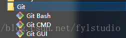

* Git CMD：Git的命令操作窗口。
* Git Bash：也是Git的命令操作窗口，基于Git CMD，但是在其基础上增添了一些新的命令与功能，因此建议使用Git Bash，使用起来更加方便，接下来的演示操作全部在Git Bash中进行。
* Git GUI：Git的可视化图形操作界面，还没有仔细研究，接下来有时间再研究，总觉得Git操作命令更酷一点。

**1,定位到本地文件夹**

在电脑的资源管理器中，定位到准备作为本地仓库的文件夹（里面是已经存在的文件或子文件夹），当然也可以新建一个空的文件夹作为本地仓库。

**2,执行“Git Bash Here”**

在文件夹上单击鼠标右键，在弹出的快捷菜单中单击执行“Git Bash Here”。（这里解释一下，为什么不在开始菜单中执行Git Bash呢？这是因为从开始菜单中执行Git Bash，默认就在“C:\Users\你自己的操作系统的用户名”文件夹下，通过命令操作才能进入到准备建立本地仓库的文件夹下，比较麻烦，而“Git Bash Here”就可以直接进入到选中的文件夹下）

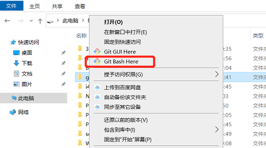

**3,打开Git Bash，并且自动进入到选中的文件夹中。**

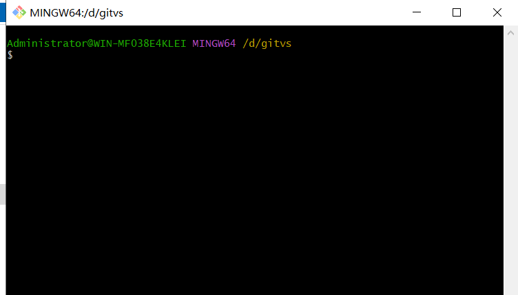

**4,配置用户名**

git config --global user.name "你自己的用户名"：这个命令配置用户名。

git config user.name：这个命令查看已经配置的用户的名。

**5,配置用户的邮箱**

git config --global user.email "你自己的邮箱"：这个命令配置用户邮箱。

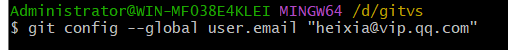

git config user.email：这个命令查看已经配置的邮箱。

**6,初始化本地仓库**

git init：这个命令初始化本地仓库（你自己的操作界面与我的可能不同，因为我已经在此文件夹中配置了一个本地仓库）。

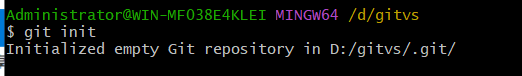

**7,暂存文件**

git add . ：这个命令暂存所有更改的文件。

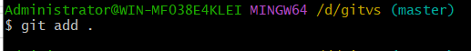

**8,提交文件**

git commit -m “第一次提交”：这个命令提交所有文件到版本库（-m 后面是备注信息）。

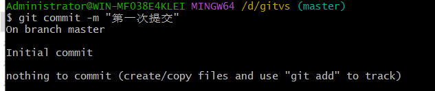

`上面有输出一些东西，这些因为我们没有改动文件，提交的空白的，不用管。`

**9,生成SSH私钥和公钥**

ssh-keygen -t rsa -C “你自己的邮箱”：这个命令生成SSH私钥和公钥（有提示信息时，直接回车就可以了，总共三次回车）。

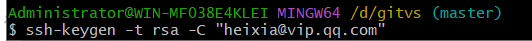

**10,拷贝公钥待用**

在“C:\Users\你自己的操作系统的用户名\ .ssh”文件下有三个文件，其中id_rsa.pub就是公钥，用记事本打开，复制全部内容，过一会在GitHub中要用。

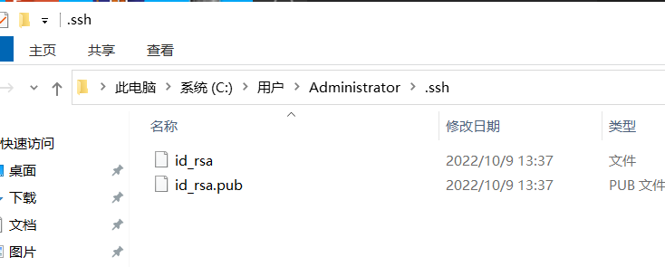

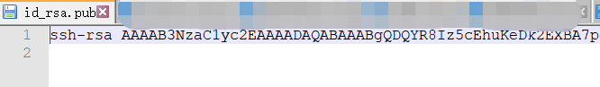

### 二、GitHub配置

- 打开 GitHub网站：https://github.com/。
- 登录GitHub网站,如果没有注册就注册一下（这个就不说了，虽然是英文网站，但是使用起来没有难度）。
- 在GitHub上配置SSH公钥
正确登录之后，单击“用户图标”，在弹出的菜单中单击“Settings”。

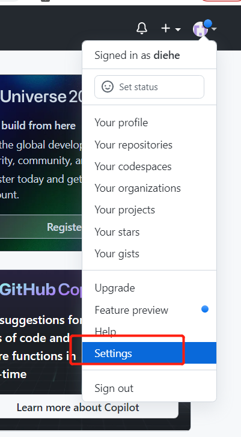

单击左侧的“SSH and GPG keys“。

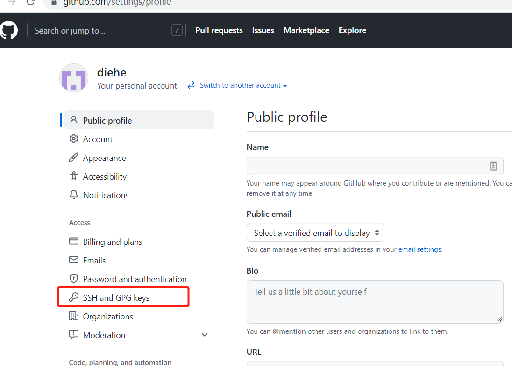

单击右上角的”New SSH key“按钮

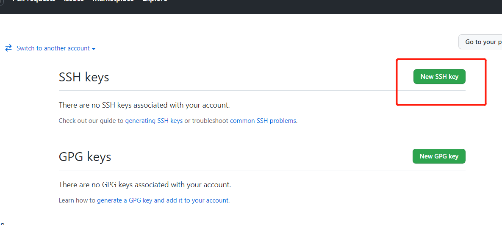

在”Title“中输入一个标题（随意），在”Key“中粘贴刚才拷贝的公钥，然后单击”Add SSH key“按钮完成公钥的配置。

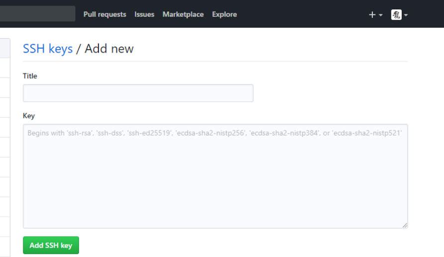

这是添加完成的样子

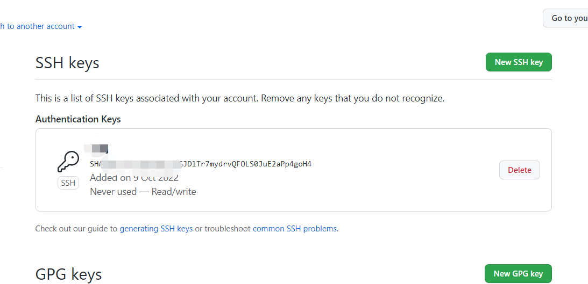

- 在GitHub上新建一个远程仓库

在GitHub网站上，单击用户图标左边的”+“号按钮，在弹出的菜单中单击”New repository“。

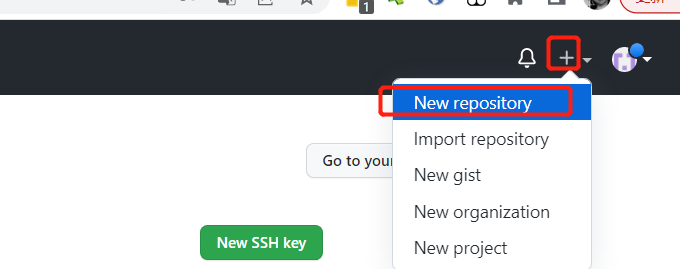

在”Repository name“文本框中输入一个名称，在”Description“文本框中输入一个介绍（可选项），其它默认，然后单击下面的”Create Repository“按钮完成远程仓库的建立。

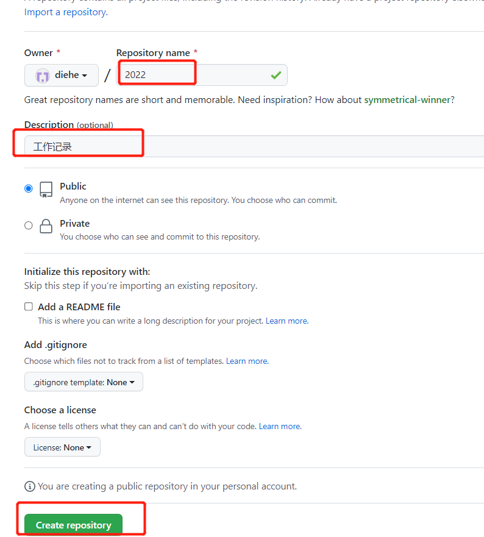

复制远程仓库的地址，后面要用

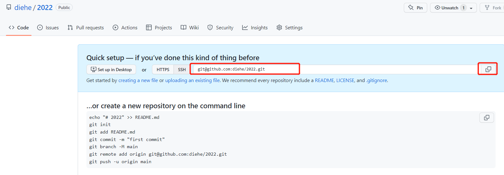

（你看到的界面有可能和我的不同，如果不同则：单击绿色的”Clone or download“按钮，在弹出的对话框中，单击右上角的”Use SSH“切换到SSH模式，默认是”Use HTTPS“模式，然后复制文本框中的远程仓库地址）。

### 三、配置Git，让本地仓库和GitHub的远程仓库建立关联

- 配置远程仓库
git remote add  远程仓库的名称（随意） 刚才复制的远程仓库的地址（这个很重要，不能错）：这个命令配置一个远程仓库，即与本地仓库建立起关联。

git remote -v：这个命令查看已经建立关联的远程仓库的详细信息。

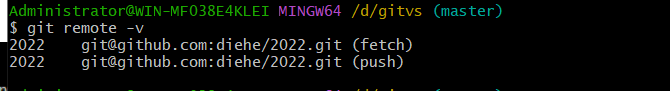

- 测试远程仓库连接
ssh -T git@github.com：这个命令测试远程仓库的网络连接情况，如果显示”You've successfully“等信息就说明前面的配置没有问题，可以成功连接到Github。

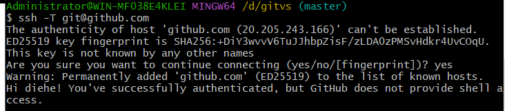

如果出现我图上面的提示，就是默认ip无法连接，照着提示回车，然后输入yes即可

- 将远程的仓库合并到本地仓库（否则系统认为远程和本地是两个不同的仓库，就无法实现PULL和PUSH了）。

git pull 2022 master --allow-unrelated-histories：这个命令合并远程仓库到本地仓库，其中”2022“要换成你自己的远程仓库的名称，后面的”--allow-unrelated-histories“这个参数不能省，否则出错。

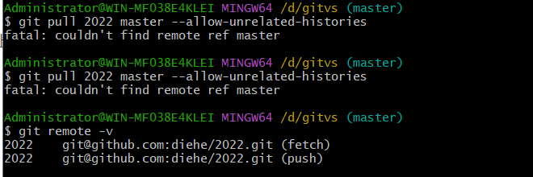

- 将本地仓库的内容推送到远程仓库中
git push 2022 master：这个命令将本地仓库中的内容推送到了远程仓库，其中”2022“要换成你自己的远程仓库的名称。再打开GitHub网站，就可以在看见的推送的内容了，即本地仓库和远程仓库一致。

如果出现我图上的提示，无需关注，因为我们项目文件夹是空的。忽略它。

### 四、在Visual Studio Code中使用Git和GitHub
如果上述配置全部正确，那么就可以在Visual Studio Code中直接使用了，不用其它配置，而且直接在图形界面中通过鼠标进行操作，非常方便（当然你也可以通过上述介绍的命令方式操作，结果都一样）。

- 暂存文件

如果你在Visual Studio Code中对本地仓库中的文件进行了内容的修改或者新增、删除了文件，都会在”源代码管理“图标上有数字显示（表示有多少个文件进行改变）。

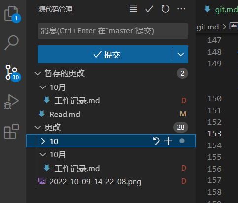

**其中”D“表示删除了文件，”M“表示了修改了已有文件的内容等等。**

单击系统菜单，然后执行”暂存所有更改“菜单命令则将改变了文件进行了暂存。

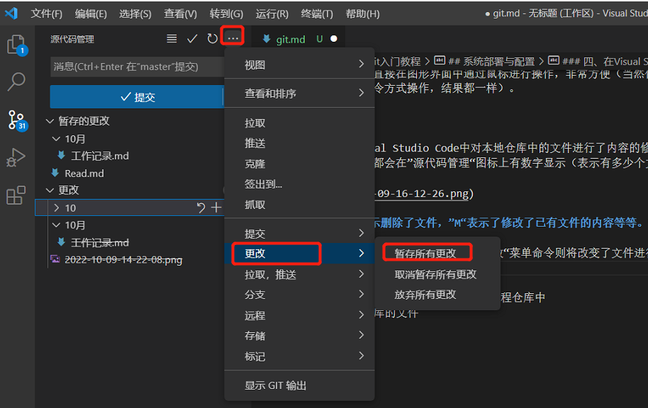

此时，界面会对已经暂存更改和没有暂存的更改进行显示。

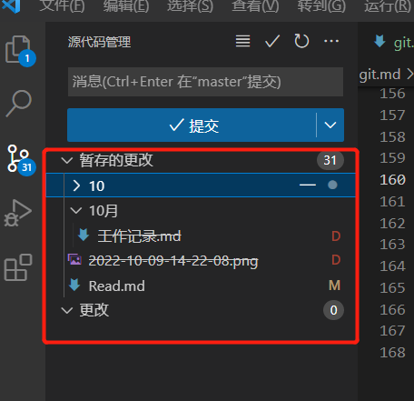

- 提交文件到本地仓库

单击系统菜单，然后执行”全部提交“菜单命令。

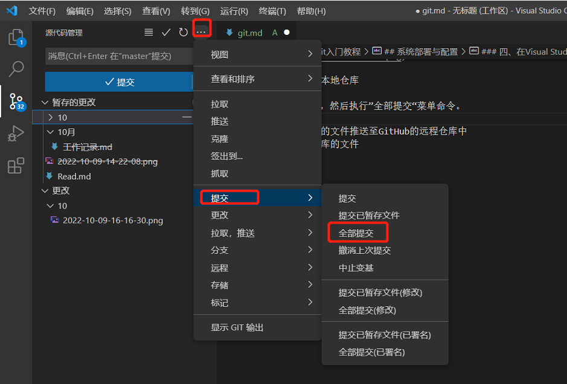

- 本地仓库中的文件推送至GitHub的远程仓库中
- 查看远程仓库的文件

最全实用插件