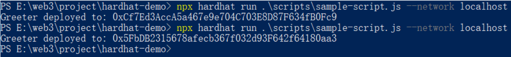

# web3开发DApp项目技术入门教程

## 智能合约创建和部署

### 一、Hardhat 是什么？
Hardhat框架https://hardhat.org/，是一个以太坊DApp开发的本地集成开发套件。经常与之对比的是 Hardhat vs Truffle。相比其它作为web3基础设施的开发工具，Hardhat 更加轻量，采用插件化的思想，非常适合作为新手dapp开发入门的工具。

### 二、环境准备 —— 安装 Node.js

在使用 Hardhat 进行开发以前，首先需要在本地安装 Node 环境。

nodejs官网的下载地址:https://nodejs.org/en/download/，根据自己操作系统的配置，选择合适的版本下载。

**注意**:如果电脑上已经安装过，记得升级到 node v14 及以上的版本，更早的版本不支持 Hardhat。

看一下是否安装成功，分别输入：  
  node -v  
  npm -v  
  npx -v  

我这里是 Windows 系统，用 PowerShell 执行一下上面几条命令，可以看到已经安装成功了。

### 三、开始第一个web3项目

1. 初始化
首先创建一个目录 hardhat-demo，进到这个目录里，执行 npx hardhat init 命令：  
  mkdir hardhat-demo  
  cd hardhat-demo  
  npx hardhat init  

这时会问你几个问题，一路回车即可。

**npx hardhat init** 的作用是：按照模板创建了一个示例项目。当出现 “Project created” 字样时，代表项目创建成功。

可以看到，在上面的截图里，提示了我们要安装依赖。为了能让这个示例项目跑起来，还需要安装几个依赖模块：

  npm install --save-dev "hardhat@^2.9.1" "@nomiclabs/hardhat-waffle@^2.0.0" "ethereum-waffle@^3.0.0" "chai@^4.2.0" "@nomiclabs/hardhat-ethers@^2.0.0" "ethers@^5.0.0" 

安装完以后，这个目录下的文件应该有这些：

这样，你就成功完成了第一个步骤。

2. 项目中的文件作用

创建好这个示例项目以后，这里来分析一下这些文件的作用。这一部分略微有一些枯燥，你也可以先阅读“3. 智能合约的编译、部署和测试”这一部分，之后再来看这些文件的作用。

- node_modules/、package-lock.json 和 package.json
这些是 node 项目的必须组成部分，包括了项目的配置信息、安装的依赖模块等，这里可以先无视。

- contracts/Greeter.sol
这个文件是项目中的重点，叫**智能合约文件**。什么是智能合约呢？你可以把智能合约，同样理解为一种可以运行的程序。只不过这个程序比较特殊，它是运行在以太坊的 EVM 虚拟机 环境上。并且，程序本身、程序的输入输出、运行结果等，对所有人可见。

Solidity语言，是智能合约开发的主流语言之一。Solidity语言的入门教程，不是本文涉及的重点，这里只是简单提一下。

简单用 Java 类比一下：

原来你写了一段 Java 代码，放进一个源文件叫作 HelloWorld.java，用 javac 执行编译，最终在自己的电脑或者服务器上，被 JVM 虚拟机执行；现在写了一段 Greeter.sol 代码，它也可以被编译，被执行，只不过运行环境变成了以太坊的 EVM 虚拟机。

初始化项目以后，自动生成的代码是这样的：

  //SPDX-License-Identifier: Unlicense   // 声明 license 
  pragma solidity ^0.8.0;                // 定义版本号 
   
  import "hardhat/console.sol";          // 导入其它智能合约文  件 
   
  contract Greeter {                     // 定义一个合约，合约  名字叫 Greeter 
      string private greeting;           // 这个合约的一个私有  变量 
   
      constructor(string memory _greeting) {   // 合约的构造函  数，当且仅当合约被部署时，会被执行一次 
          console.log("Deploying a Greeter with greeting:",   _greeting); 
          greeting = _greeting; 
      } 
   
      function greet() public view returns (string memory)   {   // 可以被外部调用的合约方法，view 声明了这是个只读方  法，不会改变合约的状态 
          return greeting; 
      } 
   
      function setGreeting(string memory _greeting) public   {    // 这是一个写方法，会改变合约的状态，且外部调用时会消  耗 gas 
          console.log("Changing greeting from '%s' to '%s'",   greeting, _greeting); 
          greeting = _greeting; 
      } 
  } 

第 1 行 pragma solidity ^0.8.0;，声明了 License，比如 GPL-3.0；

第 2 行 pragma solidity ^0.8.0;，声明了编译器版本，这里面强制指定了版本不得低于 0.8.0，也不能高于 0.9.0；

第 4 行 import"hardhat/console.sol"; 导入了其它合约文件，这里面的 hardhat/console.sol 文件，是 Hardhat 框架自带的，是一个用于方便调试的合约文件，源码在这里；

第 6 行 contract Greeter 开始，就是合约的主体部分。从结构上看，它很像是在 C++ 或者 Java 中定义一个类，也包括了字段变量、构造方法、读方法、写方法等。这里面出现了几个特殊的关键字：

* contract ：声明一个合约；
* memory：和 storage 关键字相反，代表了变量只会临时放在内存中，不会存储在合约的状态中；
* view：声明该方法为只读方法，不会改变合约本身的状态。

- scripts/sample_scripts.js

这个 JavaScript 文件的作用，是将刚才的 Greeter.sol 智能合约编译并部署到链上。

  const hre = require("hardhat");    // 声明依赖库 
   
  async function main() {            // 定义 main 函数 
    const Greeter = await hre.ethers.getContractFactory  ("Greeter");    // 获取合约 Greeter 
    const greeter = await Greeter.deploy("Hello,   Hardhat!");      // 部署合约，并得到一个合约的实例 
   
    await greeter.deployed();     // 等待合约部署完成 
   
    console.log("Greeter deployed to:", greeter.  address);   // 打印日志，记录合约的地址 
  } 
   
  // 执行 main 函数 
  main() 
    .then(() => process.exit(0)) 
    .catch((error) => { 
      console.error(error); 
      process.exit(1); 
    }); 

* 在注释中写上了各行代码的作用。这里要注意几点：
合约的部署需要一定的时间，因为使用 await greeter.deployed() 异步方法，等待合约部署完成。
* 用 Java 代码类比一下：Greeter 这个合约像是一个类，而每次部署得到的 greeter 像是 new 了一个类的对象。因此每次部署，都会生成出不同的对象，得到的合约地址也就不同。

- test/sample_test.js

单元测试对于 web3开发来说同样重要。sample_test.js 这个文件就是一个单元测试的文件，使用了 **chai** 这个测试框架：

  // 引入依赖 
  const { expect } = require("chai");  
  const { ethers } = require("hardhat"); 
   
  // describe 和 it 指示了在进行 case test 
  describe("Greeter", function () { 
    it("Should return the new greeting once it's changed",   async function () { 
      // 这里和 scripts/sample_scripts.js 中的代码一样，也是获  取合约 + 部署合约 + 等待部署完成 
      const Greeter = await ethers.getContractFactory  ("Greeter"); 
      const greeter = await Greeter.deploy("Hello, world!"); 
      await greeter.deployed(); 
   
      expect(await greeter.greet()).to.equal("Hello,   world!");    // 测试点 1 
   
      // 执行合约的写方法 
      const setGreetingTx = await greeter.setGreeting("Hola,   mundo!");   
      await setGreetingTx.wait(); 
   
      expect(await greeter.greet()).to.equal("Hola,   mundo!");     // 测试点 2 
    }); 
  }); 

- hardhat.config.js

接下来，我们会启动 HardHat，进行区块链本地环境的搭建部署。在正式启动之前，需要进行一些配置。hardhat.config.js 这个文件，就是在 Hardhat 启动时，默认要读取的配置文件。
  // 声明依赖 
  require("@nomiclabs/hardhat-waffle");    
   
  // 声明 Hardhat 启动时执行的任务，下面这个任务的作用是打印账户  的信息 
  task("accounts", "Prints the list of accounts", async   (taskArgs, hre) => { 
    const accounts = await hre.ethers.getSigners(); 
   
    for (const account of accounts) { 
      console.log(account.address); 
    } 
  }); 
   
  // 声明配置项 
  module.exports = { 
    solidity: "0.8.4", 
  }; 

这里可以看到，文件的内容可以分为 3 个部分：
* 声明依赖的模块。
* 声明启动时执行的任务：在官方文档里面有更加详细的说明，这里的示例 task 的作用是：启动 Hardhat 时，打印出本地这条链的默认账户。
* 声明配置项：更详细的说明可以参考官方文档，这里说明一下常见配置的含义：
  module.exports = { 
    solidity: "0.8.4",   // solidity 编译器的版本 
    networks: {          // 网络配置情况，下面可以添加多个网络的  配置 
      localhost: {       // 本地网络 
        url: "http://127.0.0.1:8545"    // 本地网络的 url 
      }, 
      hardhat: {             // Hardhat 网络配置 
   chainId: 31337,      // 链 ID，默认 31337 
        gasPrice: "auto"     // gas 价格，默认 auto 
      }, 
      rinkeby: {        // rinkeby 网络 
        url: "https://eth-rinkeby.alchemyapi.io/v2/  123abc123abc123abc123abc123abcde",           //   rinkeby 结点的 url 
        accounts: [privateKey1, privateKey2, ...]    // 使用的  账户列表 
      } 
    }, 
  }; 

在“1. 初始化”中，执行了 npx hardhat init 以后，会生成出一个默认的配置文件。一般来说，使用这个默认配置即可，不需要更改。

这里面有一个问题，上面的配置中，同时出现了 localhost 和 hardhat 两种网络。它们有什么不同呢？这里暂时先不提，在 “3. 智能合约的编译、部署和测试”这一部分中，你就会找到答案。

这样，项目中各个文件的作用就介绍完毕。可能略微有点枯燥，马上就可以进入实战环节了。

3. 智能合约的编译、部署和测试
- MetaMask钱包下载、安装及账户新建
**MetaMask** 是什么呢？它是一个以太坊生态下的钱包，可以管理你的账户，支持多种网络。

MetaMask钱包本质上是一个浏览器插件，这里有它的下载地址:https://metamask.io/download/ （可能需要科学上网），然后像正常添加其它浏览器插件一样，添加上去就好。

接下来可以通过助记词的方式，生成一个新账户；也可以通过粘贴私钥的方式，导入你原有的账户。

这样，我们的 MetaMask 钱包就准备好了。

- 在本地网络上部署合约

接下来我们要启动一个本地区块链网络节点。

首先打开一个 Terminal/Powershell 窗口，执行 npx hardhat node 命令：

这个命令的作用是：按照 hardhat.config.js 中声明的配置，启动一个本地区块链网络的节点。在每次启动时，默认会提供 20 个钱包账户和私钥，每个钱包提供 10000 个 ETH 做测试。

可以看到，Hardhat 启动时，把这 20 个账户的信息打印了出来。为什么会打印账户信息呢？因为在 hardhat.config.js 中定义了这个执行任务；如果你忘记了，可以回过头看一下。

启动成功了，还可以用 MetaMask 这个钱包再验证一下。

新增一个 localhost 网络，注意链 ID 要和 hardhat.config.js 中的 chainId 相同，默认是 31337.

导入一个账户，这里我选择了那 20 个自动账户中的第 1 个，把私钥粘贴进去。

  这里注意一下，这些账户仅仅是为了本地测试使用，千万不要在以太坊主网使用这些账户地址！切记！

现在，本地网络环境已经就绪，我们把 contracts/Greeter.sol 部署到本地网络上。
打开另一个 Terminal/PowerShell，执行 
  npx hardhat run .\scripts\sample-script.js --network localhost

于是会执行 scripts/sample_scripts.js 中的 main 方法，并且打印出了 Greeter 这个合约的部署地址。

同样地，在启动本地网络的窗口中，也可以看到刚才这个合约的部署情况：

在部署合约时，会执行 constructor 构造函数，所以 console.log("Deploying a Greeter with greeting:", _greeting); 这句被执行并打印出来。

部署合约需要消耗 gas，所以可以看到第一个账户中的余额不再是 10000 个 ETH 了（默认使用第一个账户来操作）：

再执行一次 npx hardhat run .\scripts\sample-script.js --network localhost，会发现虽然是同一份合约代码，但是合约地址发生了变化：

正如在 “scripts/sample_scripts.js” 中所说，用 Java 代码类比一下：Greeter 这个合约像是一个类，而每次部署得到的 greeter 像是一个类的对象，因此每次部署，生成出了不同的对象，得到的合约地址也就不同。

我们把 scripts/sample_scripts.js 稍作修改，就可以得到web3版本的 Hello World 了：

  const hre = require("hardhat"); 
   
  async function main() { 
    const Greeter = await hre.ethers.getContractFactory  ("Greeter"); 
    const greeter = await Greeter.deploy("Hello, World!"); 
   
    await greeter.deployed(); 
   
    console.log("Greeter deployed to:", greeter.address); 
  } 
   
  main() 
    .then(() => process.exit(0)) 
    .catch((error) => { 
      console.error(error); 
      process.exit(1); 
    }); 

到这步为止，我们的 Greeter 合约就成功在本地网络上部署好了，也成功使用 MetaMask 钱包，进行了本地网络连接、测试账户导入。

- Hardhat 其它常见的命令

刚才我们学习了 Hardhat框架的 2 个命令：

  npx hardhat node
启动区块链网络一个本地节点

  npx hardhat run .\scripts\sample-script.js --network localhost 
把合约部署到了本地网络上。

这一部分，会说明一下其它 Hardhat 的实用命令。
  npx hardhat test
这个命令用于执行单元测试，在示例中，也就是运行了 test/sample_test.js 这个文件：

这代表测试成功。我们稍微修改一下 sample_test.js 文件：
  const { expect } = require("chai"); 
  const { ethers } = require("hardhat"); 
   
  describe("Greeter", function () { 
    it("Should return the new greeting once it's changed",   async function () { 
      const Greeter = await ethers.getContractFactory  ("Greeter"); 
      const greeter = await Greeter.deploy("Hello, world!"); 
      await greeter.deployed(); 
   
      expect(await greeter.greet()).to.equal("Hello,   world!"); 
   
      const setGreetingTx = await greeter.setGreeting("Hola,   mundo!"); 
   
   // wait until the transaction is mined 
      await setGreetingTx.wait(); 
   
      expect(await greeter.greet()).to.equal("Hello,   world!"); 
    }); 
  }); 
再次执行命令，就会发现测试失败了：

你可能会问一个问题：在 sample_test.js 的代码中，同样出现了合约的部署语句，那么这个合约是被部署到了哪里呢？再次被部署到了 localhost 这个本地网络上吗？

答案是否定的。

还记得在 “⑤ hardhat.config.js” 一节中提过，有两个很相似的网络配置: localhost 和 hardhat。当执行 npx hardhat test 命令时，会内置创建 hardhat 网络，并在 hardhat 网络上完成合约部署、方法调用等，不会部署在 localhost 网络上。这一点一定要注意。

  npx hardhat console

这个命令的作用是启动一个控制台程序，方便交互式输入输出。例如输入 config 查看配置情况：

在 sample_scripts.js 中的代码语句，可以换成在 console 中执行：

  npx hardhat compile

在执行 npx hardhat run .\scripts\sample-script.js --network localhost 部署合约的时候，其实 hardhat 偷偷帮你做了一件事情：编译。

我们把 artifacts 和 cache 目录删掉，现在的目录结构应该是这样：

现在我们执行 npx hardhat compile 命令，执行成功后，会发现刚才删掉的 artifacts 和 cache 目录，又重新生成出来了

所以，这个命令的作用就是编译。cache 是编译出来的缓存文件夹。artifacts 目录下的文件很重要，看一下 artifacts/contracts/  Greeter.sol/Greeter.json 这个文件：
  
  { 
    "_format": "hh-sol-artifact-1", 
    "contractName": "Greeter", 
    "sourceName": "contracts/Greeter.sol", 
    "abi": [ 
      { 
        "inputs": [ 
          { 
            "internalType": "string", 
            "name": "_greeting", 
            "type": "string" 
          } 
        ], 
        "stateMutability": "nonpayable", 
        "type": "constructor" 
      }, 
      { 
        "inputs": [], 
        "name": "greet", 
        "outputs": [ 
          { 
            "internalType": "string", 
            "name": "", 
            "type": "string" 
          } 
        ], 
        "stateMutability": "view", 
        "type": "function" 
      }, 
      { 
        "inputs": [ 
          { 
            "internalType": "string", 
            "name": "_greeting", 
            "type": "string" 
          } 
        ], 
        "name": "setGreeting", 
        "outputs": [], 
        "stateMutability": "nonpayable", 
        "type": "function" 
      } 
    ], 
    "bytecode": "0x......", 
    "deployedBytecode": "0x......", 
    "linkReferences": {}, 
    "deployedLinkReferences": {} 
  } 

这个文件和原始文件 contracts/Greeter.sol 有点儿像，又有点儿不像。它就是源文件编译出来的样子。这个文件很重要，我们之后还会用到它。

  npx hardhat clean

这个命令和 npx hardhat compile 的作用恰好相反，是把编译出来的文件清理一下。

最后，还有一个重要的命令，叫作 npx hardhat help，这条命令会展示 npx hardhat 系列命令的用法：当你忘记的时候，就可以用这条命令查询一下。

### 四、结语

跟随本文，你已经掌握了 Hardhat 开发框架的基本用法；创建了一个web3项目；编写修改了智能合约；执行了单元测试；启动运行了本地区块链节点；将合约文件成功进行编译和部署；还安装了 MetaMask 钱包，并连接了本地网络和测试账户进行测试。
